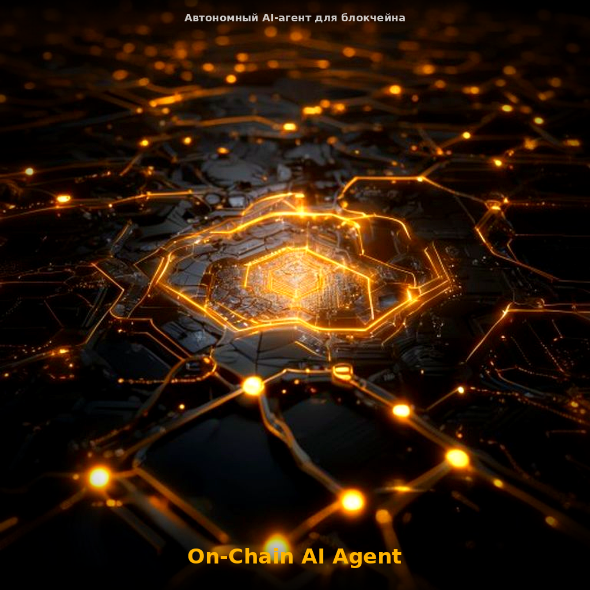
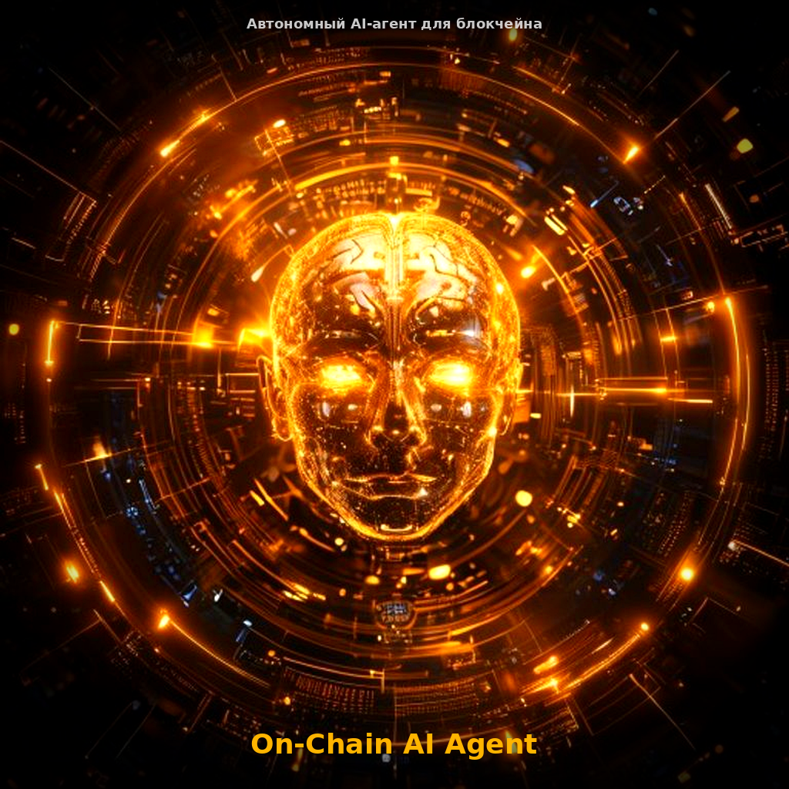
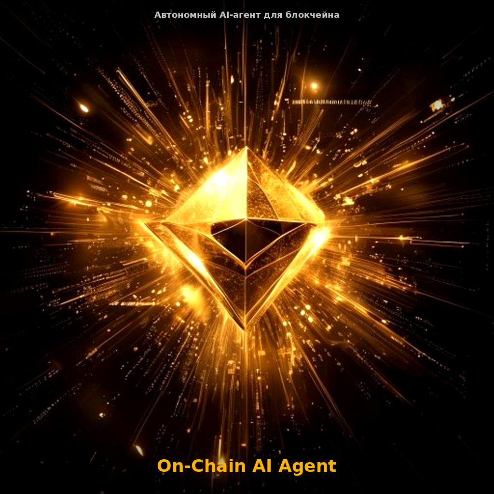
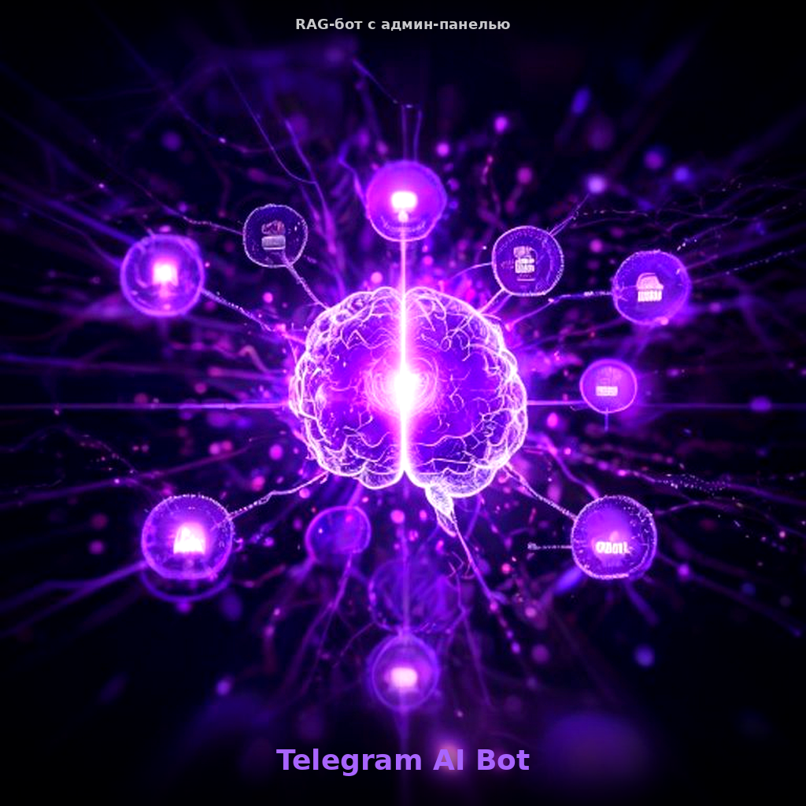
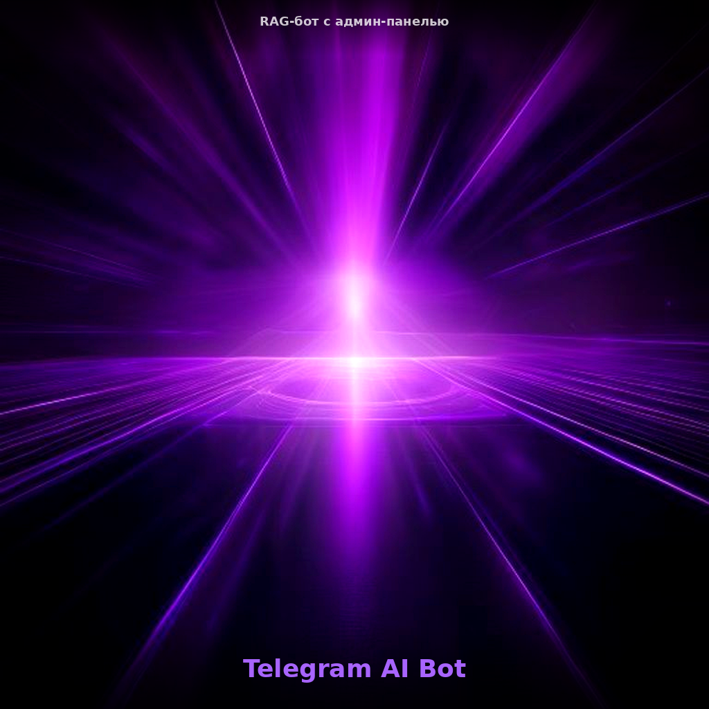

# mrpkk — AI Agent & Blockchain Developer

> Autonomous AI systems, smart contracts, and Web3 automation.

## What I Build

I create **autonomous AI agents** that operate 24/7 on blockchains — making decisions, executing transactions, and managing assets without human intervention. I also build **Telegram bots** with AI capabilities (RAG, analytics, content generation).

## Projects

### 🤖 On-Chain AI Agent Framework
**Full-stack framework for autonomous blockchain agents**

- Agent Core: Perception → Reasoning → Planning → Execution
- AI-powered decision making (Mistral AI, Chain-of-Thought)
- Ricardian Agreements — legally binding + code-enforced contracts
- ERC-8004 Agent Identity — on-chain passports for AI agents
- Escrow system for agent-to-agent commerce
- Spending limits, kill switch, simulation mode, audit logs

**Stack:** Python, FastAPI, Web3.py, Solidity, Hardhat, Docker
**Chains:** Ethereum, BSC, Polygon, any EVM

[Live Demo](https://mrpkk.github.io/portfolio/demos/agent-dashboard.html) | [Docs](https://github.com/mrpkk/portfolio/blob/main/docs/architecture.md)

---

### 💬 Telegram AI Bot (RAG + Admin Panel)
**Commercial product for enterprise document Q&A**

- RAG system: Mistral Embeddings API + ChromaDB + LangChain
- Telegram bot with FAQ, feedback buttons, admin commands
- Streamlit admin panel (documents, FAQ, analytics, logs)
- Docker Compose deployment

**Stack:** Python, FastAPI, Telegram Bot API, Streamlit, ChromaDB, Mistral AI
**Pricing:** $500–$2000 implementation + $200/mo support

[Live Demo](https://mrpkk.github.io/portfolio/demos/telegram-bot.html) | [GitHub](https://github.com/mrpkk/telegram-ai-bot)

---

### 📊 RAG Corp Bot
**Lightweight document Q&A bot**

- Upload PDFs → get instant answers
- Mistral AI for LLM + Embeddings (free tier)
- ChromaDB vector store
- Demo page with working bot

**Stack:** Python, LangChain, ChromaDB, Mistral AI
**GitHub:** [mrpkk/rag-corp-bot](https://github.com/mrpkk/rag-corp-bot)

---

### 🛕 Nivritti — Vedic Autonomous Media System
**AI-powered Vedic content across 5 Telegram channels**

- Muhurta-aware scheduler (30 muhurtas × 48 min from sunrise)
- Auto-generates content in 5 niches: Advaita, Vedas, Yoga, Mantras, Muhurtas
- Multilingual publishing (TG + VK)
- FastAPI dashboard, Mistral AI content generation

**Stack:** Python, FastAPI, Swisseph (astronomy), Mistral AI, Telegram API
**Status:** Running 24/7, 6 posts/day in auspicious muhurtas

---

### 📰 Pravritti — Content Pipeline
**AI-generated tech news for 7 TG + 5 VK + Dzen**

- 8 sources: HN, ArsTechnica, BleepingComputer, TechCrunch, Wired, Habr, ExploitDB, Reddit
- 7 unique AI personas per channel (military, cybersecurity, CTO, crypto, economist...)
- Multi-platform publishing with image generation
- Scheduled 4x/day

**Stack:** Python, Mistral AI, Pollinations (images), Telegram API, VK API, RSS

---

### 💰 Artha — Crypto Automation System
**7 autonomous scripts for crypto monitoring and monetization**

- Signal Bot: AI-generated trading signals → Telegram
- Airdrop Farmer: scans CoinGecko + DeFiLlama for opportunities
- Arbitrage Scanner, Funding Monitor, Liquidation Monitor
- Income Engine, Report Generator

**Stack:** Python, CoinGecko API, DeFiLlama API, Mistral AI, Telegram API

---

## Tech Stack

| Category | Technologies |
|----------|-------------|
| **AI/ML** | Mistral AI, LangChain, ChromaDB, RAG pipelines |
| **Blockchain** | Solidity, Web3.py, Hardhat, EVM chains |
| **Backend** | Python, FastAPI, PostgreSQL, Redis, Docker |
| **Frontend** | React, TypeScript, TailwindCSS, Streamlit |
| **Telegram** | python-telegram-bot, Bot API, TG channels |
| **DevOps** | Docker, systemd, nginx, CI/CD |

## Contact

- **GitHub:** [github.com/mrpkk](https://github.com/mrpkk)
- **Telegram:** [@mrpkk](https://t.me/mrpkk)

## Freelance Services

## Изображения для фриланса

### 🤖 On-Chain AI Agent Framework
| Cover | Selling 1 | Selling 2 | Selling 3 |
|-------|-----------|-----------|-----------|
|  |  |  |  |

### 💬 Telegram AI Bot (RAG + Admin)
| Cover | Selling 1 | Selling 2 | Selling 3 |
|-------|-----------|-----------|-----------|
|  |  |  |  |

### 📊 RAG Corp Bot
| Cover | Selling 1 | Selling 2 | Selling 3 |
|-------|-----------|-----------|-----------|
|  |  |  |  |

---

## Pricing

| Service | Price |
|---------|-------|
| Telegram Bot (AI/RAG) | $500–$2000 |
| On-Chain AI Agent | $1500–$5000 |
| Smart Contract Audit | $1000–$3000 |
| DeFi Integration | $2000–$8000 |
| SaaS Platform | $3000–$15000 |
| Monthly Support | $200–$500/mo |
